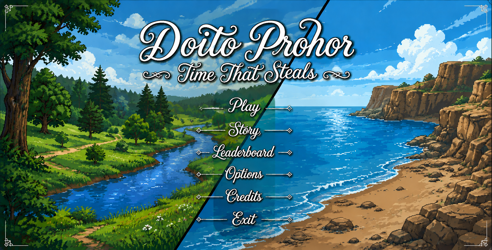
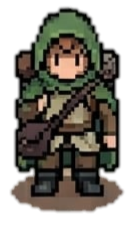

# Doito Prohor - The Time that Steals

## Game Description

**Doito Prohor - The Time that Steals** is a cooperative, split-screen puzzle-adventure game created using the **iGraphics** library in C++. The game places two players in parallel, interconnected worlds where they must communicate, solve puzzles, collect items, and work together to restore balance and complete the journey.

## Features
- Two players explore separate but interconnected worlds.
- Temporal Coupling lets actions in one world affect the other.
- Item collection and usability support puzzle solving and progression.
- AI-controlled enemies, combat, health, and weapon systems.
- Multiple maps, structure mazes, companion animals, and game-end conditions.

## Project Details
IDE: Visual studio 2010

Language: C,C++.

Platform : Windows PC.

Genre : 2D cooperative puzzle adventure

## How to Run the Project

Make sure you have the following installed:
- **Visual Studio 2010**
- **MinGW Compiler** (if needed)
- **iGraphics Library** (included in this repository)

Open the project in Visual Studio 2010
- Open Visual Studio 2010.
- Go to File → Open → Project/Solution.
- Locate and select the .sln file from the cloned repository.
- Click Build → Build Solution
- Run the program by clicking Debug → Start Without Debugging

## How to Play

### **Controls**
| Player       | Move Left | Move Right | Move Up | Move Down | Interact | Attack | Heal |
|-------------|----------|-----------|---------|-----------|----------|-------|-----|
| **Player 1** | `A`      | `D`       | `W`     | `S`       | `E`      | `F`   | `R`   |
| **Player 2** | `←` (Left Arrow) | `→` (Right Arrow) | `↑` (Up Arrow) | `↓` (Down Arrow) | `0` | `5` | `6` |

### **Game Rules**

- Players must cooperate across two parallel worlds to progress.
- Time Shards and other items are collected and used to unlock interactions and structures.
- Players can enter structure mazes by interacting with entrances and meeting their item requirements.
- Enemies can damage players, while weapons can be used for combat.
- Both players must complete the required objectives and reach the final portal to finish the game.

## Project Contributors

1. Mubasshir Mahabub Chowdhury
2. Md.Abrar Rahman
3. Protik Day

## Screenshots

### **Menu**

### **Character**

## Youtube Link
[CSE 1200 Project: Doito Prohor - The Time that Steals](https://www.youtube.com/)

## Project Report
[Project Report: Doito Prohor - The Time that Steals](https://drive.google.com/drive/u/1/my-drive)
